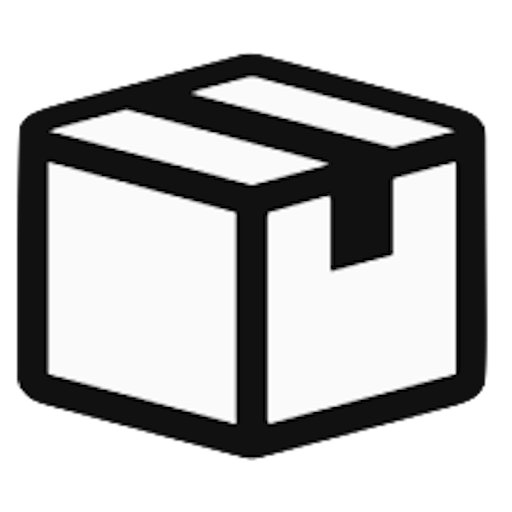
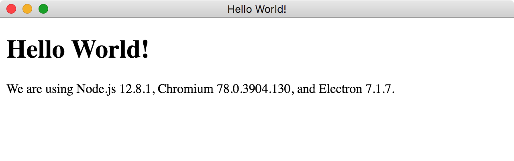
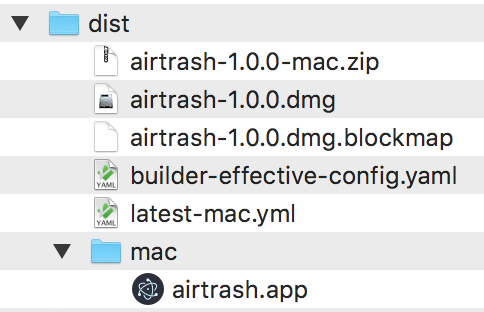
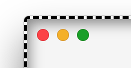
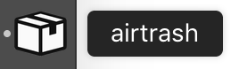

English | [简体中文](#) | [हिन्दी](#)

<div align="center">
	
	<h1>airtrash</h1>
	<p>
		<b>Clone of Apple's AirDrop - easy P2P file transfer powered by stupidity</b>
	</p>
	<br>
</div>

[](https://github.com/maciejczyzewski/airtrash/releases) [](https://github.com/maciejczyzewski/airtrash/releases)

## 🎯 Goal/Tutorial

> 100 tiny steps to build cross-platform desktop application using Electron/Node.js/C++

It's simple tutorial/guide for **absolute beginners** to present some tips for
creating desktop application. Unlike [@electron/electron-quick-start](https://github.com/electron/electron-quick-start), which presents the typical `hello world`.
This project aims to **focus on real-live scenario**, where we will try to implement
a complete product (**like cross-platform _Apple's AirDrop_ replacement**).

## 🔦 Screenshot


## 💽 Installation

Download from [GitHub Releases](https://github.com/maciejczyzewski/airtrash/releases) and install it.

### from source

To clone and run this repository you'll need [Git](https://git-scm.com) and [Node.js](https://nodejs.org/en/download/) (and [yarn](https://github.com/yarnpkg/yarn)) installed on your computer. From your command line:

```bash
# clone this repository
git clone https://github.com/maciejczyzewski/airtrash
# go into the repository
cd airtrash
# install dependencies
yarn
# run the app
yarn start
```

Note: If you're using Linux Bash for Windows, [see this guide](https://www.howtogeek.com/261575/how-to-run-graphical-linux-desktop-applications-from-windows-10s-bash-shell/) or use `node` from the command prompt.

### macOS

The macOS users can install _airtrash_ using `brew cask`.

```bash
brew update && brew cask install airtrash
```

(nice try, you can't)

## 📃 Steps

Let's begin our journey.

### 1: starting from template

Clone and run for a quick way to see Electron in action. From your command line:

> `yarn` is strongly recommended instead of `npm`.

```bash
# clone this repository
$ git clone https://github.com/electron/electron-quick-start
# go into the repository
$ cd electron-quick-start
# install dependencies
$ yarn
# run the app
$ yarn start
```

You should see:



And have this file structure:

```bash
.
├── LICENSE.md        # - no one's bothered
├── README.md         # - sometimes good to read
├── index.html        # body: what you see
├── main.js           # heart: electron window
├── package-lock.json # - auto-generated
├── package.json      # configuration/package manager
├── preload.js        # soul: application behavior
└── renderer.js       # - do after rendering

0 directories, 8 files
```

### 2: using [@electron-userland/electron-builder](https://github.com/electron-userland/electron-builder) for packing things

Our next goal will be to build `.dmg` and `.app` files with everything packed
up.

1. Run: `$ yarn add electron-builder --dev`

2. Modify _package.json_:
```diff
+   "name": "airtrash",
    "scripts": {
        "start": "electron .",
+       "pack": "electron-builder --dir",
+       "dist": "electron-builder",
+       "postinstall": "electron-builder install-app-deps"
    },
    ...
+    "build": {
+        "appId": "maciejczyzewski.airtrash",
+        "mac": {
+            "category": "public.app-category.utilities"
+        }
+    },
```

3. Run: `yarn dist`

You should see:

```
$ electron-builder
  • electron-builder  version=21.2.0 os=17.7.0
  • loaded configuration  file=package.json ("build" field)
  • writing effective config  file=dist/builder-effective-config.yaml
  • packaging       platform=darwin arch=x64 electron=7.1.7 appOutDir=dist/mac
  • default Electron icon is used  reason=application icon is not set
  • building        target=macOS zip arch=x64 file=dist/airtrash-1.0.0-mac.zip
  • building        target=DMG arch=x64 file=dist/airtrash-1.0.0.dmg
  • building block map  blockMapFile=dist/airtrash-1.0.0.dmg.blockmap
  • building embedded block map  file=dist/airtrash-1.0.0-mac.zip
✨  Done in 59.42s.
```

And have this additional files:



### 3: adding [@twbs/bootstrap](https://github.com/twbs/bootstrap) to project

Let's add some popular package (like _bootstrap_) to understand how to do it.

1. Run:
```bash
$ yarn add bootstrap --dev
$ yarn add normalize.css --dev # good practise
$ yarn add popper.js --dev # bootstrap needs this
$ yarn add jquery --dev # and this to be complete
```

2. Enable `nodeIntegration` in _main.js_:
```diff
    webPreferences : {
+      nodeIntegration : true,
       preload : path.join(__dirname, 'app/preload.js'),
    }
```

3. Modify _index.html_:
```diff
<head>
  <head>
-    <meta http-equiv="Content-Security-Policy" content="default-src 'self'; script-src 'self'">
-    <meta http-equiv="X-Content-Security-Policy" content="default-src 'self'; script-src 'self'">
+    <link rel="stylesheet" href="node_modules/normalize.css/normalize.css" />
+    <link
+      rel="stylesheet"
+      href="node_modules/bootstrap/dist/css/bootstrap.min.css"
+    />
  ...
  </head>
  <body>
  ...
+    <script>
+      window.$ = window.jquery = require('jquery');
+      window.popper = require('popper.js');
+      require('bootstrap');
+    </script>
  </body>
</html>
```

### 4: customizing window/interface

In Electron you can modify the window interface. Let's play with it.

1. Change defaults (adding icon) in _main.js_:

```diff
  mainWindow = new BrowserWindow({
+   titleBarStyle: 'hiddenInset',
+   width : 625,
+   height : 400,
+   // resizable: false, # user's don't like this option
    webPreferences : {
      nodeIntegration : true,
      preload : path.join(__dirname, 'app/preload.js'),
+     icon : __dirname + '/icon.png'
    }
  })
```

2. Because of `titleBarStyle: 'hiddenInset'`, it need to be defined new
   _draggable_ element in window. It can be achieved by adding to _index.html_:
```diff
+ <body style="-webkit-app-region: drag">
```

Result should be:




### 5: adding native extension ([@nodejs/nan](https://github.com/nodejs/nan) C++ library)

Refer to a [quick-start **Nan** Boilerplate](https://github.com/fcanas/node-native-boilerplate) for a ready-to-go project that utilizes basic Nan functionality (Node Native Extension).

1. Run:
```bash
$ yarn add electron-builder --dev
$ yarn add electron-rebuild --dev # to fix some common problems
```

2. Modify:
```diff
    "scripts": {
        "start": "electron .",
        "pack": "electron-builder --dir",
        "dist": "electron-builder",
+       "build": "node-gyp build",
+       "configure": "node-gyp configure",
+       "postinstall": "electron-builder install-app-deps && \
+                       ./node_modules/.bin/electron-rebuild"
    },
    ...
    "build": {
+       "files": [
+           "**/*",
+           "build/Release/*"
+       ],
+       "nodeGypRebuild": true,
+       "asarUnpack": "build/Release/*",
        "appId": "maciejczyzewski.airtrash",
        "mac": {
            "icon": "icon.png",
            "category": "public.app-category.utilities"
        }
    },
```

3. Add _binding.gyp_:
```diff
{
  "targets": [
    {
      "target_name": "airtrash",
      "sources": [
        "airtrash.cc",
        "src/api.cc",
      ],
      "include_dirs" : [
        "<!(node -e \"require('nan')\")"
      ]
    }
  ],
}
```

4. Add these files:
_airtrash.cc_:
```c++
#include "src/api.h"

using v8::FunctionTemplate;

#define NAN_REGISTER(name) \
  Nan::Set(target, Nan::New(#name).ToLocalChecked(), \
           Nan::GetFunction(Nan::New<FunctionTemplate>(name)).ToLocalChecked());


NAN_MODULE_INIT(InitAll) {
  NAN_REGISTER(return_a_string);
}

NODE_MODULE(airtrash, InitAll)
```

_src/api.cc_:
```c++
#include "api.h"

void return_a_string(const Nan::FunctionCallbackInfo<v8::Value> &args) {
  std::string val_example = "haha, just a string ;-)"
  args.GetReturnValue().Set(
      Nan::New<v8::String>(val_example).ToLocalChecked());
}
```

_src/api.h_:
```c++
#ifndef NATIVE_EXTENSION_GRAB_H
#define NATIVE_EXTENSION_GRAB_H

#include <nan.h>

#include "config.h"

NAN_METHOD(return_a_string);

#endif
```

5. Test in _main.js_:
```js
var NativeExtension = require("bindings")("airtrash");
console.log(NativeExtension.return_a_string());
// => haha, just a string ;-)
```

### 6: registering methods for native module

bla bla bla/register function and importing from node.js

### 7: we don't have threads, how to handle this

why there are pull.js/push.js/article link

### 8: creating basic interface in `preload.js`

why we don't need frameworks (overkill)/very simple

### 9: idea behind simple P2P (naive but should work)

port serving (my dravings)/push/pull/explore

### 10: pasting from stackoverflow (how to get ip address)

bla bla bla

### 11: TCP/socket buffer size, does it matters?

why we need to iterate trough send/recv

```diff
// babel.config.js
module.exports = {
  presets: [
    ['@babel/preset-env', {targets: {node: 'current'}}],
+    '@babel/preset-typescript',
  ],
};
```

### 12: still writing...

## 🤝 Contribute [](http://makeapullrequest.com)

If you are interested in participating in joint development, PR and Forks are welcome!

## 📜 License

[MIT](LICENSE.md) Copyright (c) Maciej A. Czyzewski
